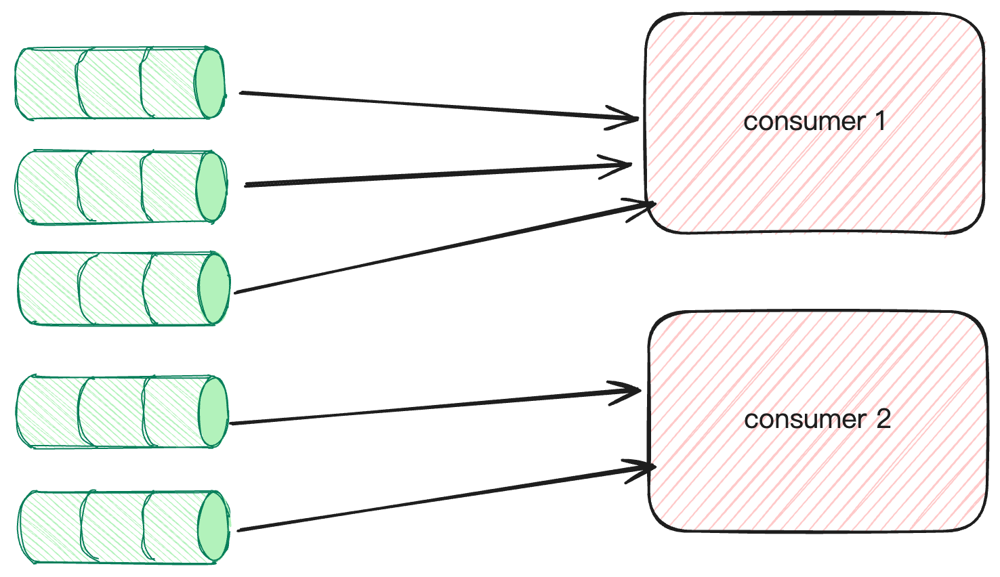
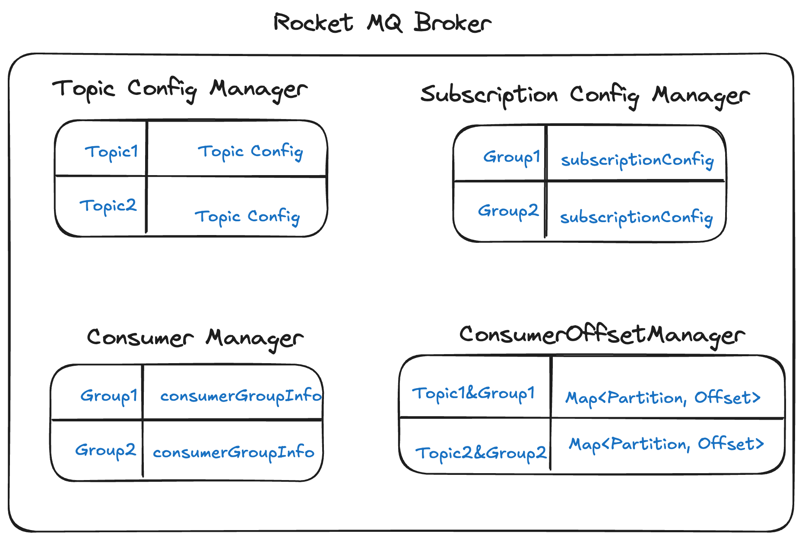
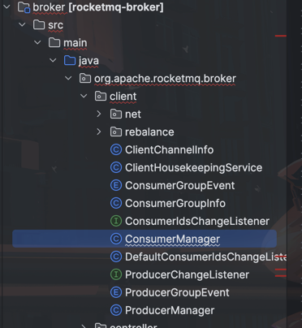
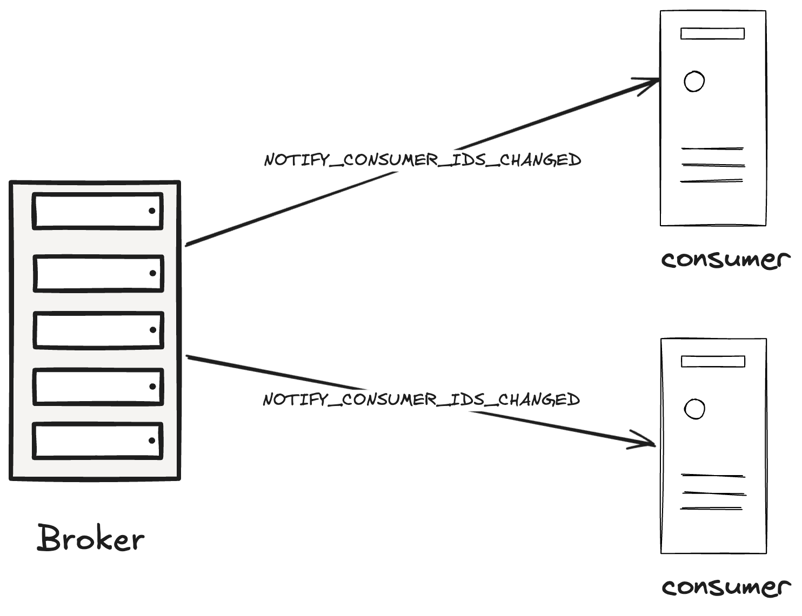
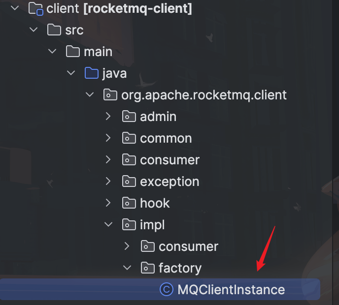
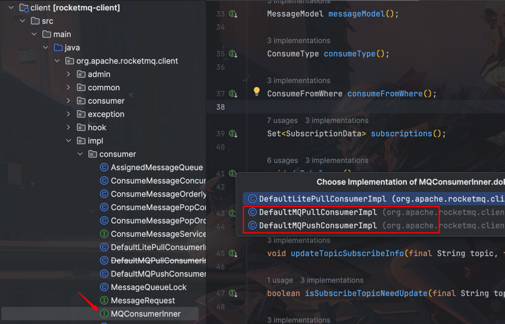
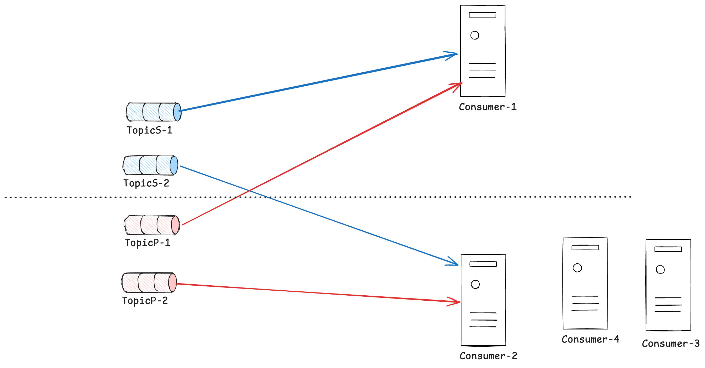

# Rocket MQ Rebalance 窥探
> 🍥因为只看了RocketMQ的一点源码(branch: release-5.0.0)，所以就只写了RocketMQ。当然也会根据查到的资料尽量与Kafka做对比。
> 
> 下文会简称RocketMQ为RMQ或者火箭队列（对打字友好🥳）

## 什么是Rebalance？
中文直译为**再均衡**。就RMQ来说是指将一个Topic下的**多个队列**（在Kafka中称之为Partition）在同一个消费者组下的多个消费实例之间进行重新分配。

Rebalance的本质是为了提升消息的**并行处理能力**。

举个🌰。假设一个Topic下有5个队列，在有两个消费者的情况下我们可以把其中3个队列个消费者1，另外两个队列给消费者2。
> 请暂时记住这个例子，下文会用到——在下文中简称上述的示例为例一



但是rebalance也会对系统稳定性带来危害——这也是本文要着重表述的点。

## Rebalance的代价
### 消费暂停
考虑Topic下有5个队列且只对应一个消费实例。为了转化到例一的情景，消费者1需要暂停它对其中两个队列的消费。

等到消费者2就绪后这两个队列才能被消费者2消费。
### 重复消费
出于性能考虑在大多数场景下，消费offset的提交都是异步的。

在消费暂停的例子中，假设broker记录的消费offset为8，消费者1可能已经消费到offset为10的消息但是还未提交到队列中。
这个时候Rebalance机制介入，消费者2就绪后并不会等待消费者1提交最新的offset。它只会根据broker记录的offset继续往后消费。

这个时候就会出现消费者2消费了已经被消费者1处理过的消息。

### 消息积压&消费突刺
结合上述提到的暂停和重复消费，有以下两个场景会导致消息积压或消费突刺。
1. 重复消息过多：新的消费者快速就绪并准备消费，但是原来的消费者由于某些原因导致broker记录的offset与真实的偏差过大。那么新的消费者就要面临很多重复消息的消费。
2. 暂停时间过长：新消费者就绪时间过长，导致消息积压的量过大。

> 下文将从生产者和消费者两个角度来剖析Rebalance机制。只有了解相应的细节，在排查问题的时候才不会像无头苍蝇一样。

## Broker端Rebalance机制
从本质上来说，触发再平衡的根本因素无非两个。
1. 订阅Topic的队列数量发生变化
2. 消费者组发生变化

|  队列信息变化 | 消费组发生变化                                                    |
|---|------------------------------------------------------------|
| broker Crash<br/> broker upgrade<br/> 队列扩缩容  | 消费者Crash<br/> 网络异常导致消费者下线<br/> 消费者主动扩缩容<br/> Topic订阅信息发生变化 |

本文中将上述信息称之为Rebalance**元数据**。Broker负责维护上述数据，在其发生变化时以某种方式通知对应的消费者组进行Rebalance。

Broker有一个元数据管理器来管理Rebalance所需的元数据

### 队列信息变化
队列信息维护在TopicConfigManager中。每个broker都会将自己的信息上报给NameServer，由NameServer来组装最终形成Topic的路由。
这个过程是动态的。

当某个broker crash之后，NameSever由于收不到该broker上报的Topic信息，会更新路由信息。这个时候客户端到NameServer拉取信息时会发现队列**变少**从而触发Rebalance。

```java
public boolean registerConsumer(final String group, final ClientChannelInfo clientChannelInfo,
        ConsumeType consumeType, MessageModel messageModel, ConsumeFromWhere consumeFromWhere,
        final Set<SubscriptionData> subList, boolean isNotifyConsumerIdsChangedEnable, boolean updateSubscription) {
        long start = System.currentTimeMillis();
        // 查找消费者组信息
        ConsumerGroupInfo consumerGroupInfo = this.consumerTable.get(group);
        // 没有就创建一个默认的
        if (null == consumerGroupInfo) {
            callConsumerIdsChangeListener(ConsumerGroupEvent.CLIENT_REGISTER, group, clientChannelInfo,
                subList.stream().map(SubscriptionData::getTopic).collect(Collectors.toSet()));
            ConsumerGroupInfo tmp = new ConsumerGroupInfo(group, consumeType, messageModel, consumeFromWhere);
            ConsumerGroupInfo prev = this.consumerTable.putIfAbsent(group, tmp);
            consumerGroupInfo = prev != null ? prev : tmp;
        }
        // 消费者组信息是否更新
        boolean r1 =
            consumerGroupInfo.updateChannel(clientChannelInfo, consumeType, messageModel,
                consumeFromWhere);
        boolean r2 = false;
        if (updateSubscription) {
            // 订阅信息是否更新
            r2 = consumerGroupInfo.updateSubscription(subList);
        }
        
        if (r1 || r2) {
            if (isNotifyConsumerIdsChangedEnable) {
                // 通知消费组内下的所有消费者实例进行rebalance
                callConsumerIdsChangeListener(ConsumerGroupEvent.CHANGE, group, consumerGroupInfo.getAllChannel());
            }
        }
        if (null != this.brokerStatsManager) {
            this.brokerStatsManager.incConsumerRegisterTime((int) (System.currentTimeMillis() - start));
        }

        callConsumerIdsChangeListener(ConsumerGroupEvent.REGISTER, group, subList);

        return r1 || r2;
    }
```
callConsumerIdsChangeListener在处理ConsumerGroupEvent.CHANGE事件时，会给每个Consumer都发送一个NOTIFY_CONSUMER_IDS_CHANGED通知，这个消费者组下的所有实例在收到通知后，各自进行Rebalance，如下图所示：


>Broker通知每个消费者各自Rebalance，即每个消费者自己给自己重新分配队列，而不是Broker将分配好的结果告知Consumer。从这个角度，RocketMQ与Kafka Rebalance机制类似，二者Rebalance分配都是在客户端进行，不同的是：
>- Kafka：会在消费者组的多个消费者实例中，选出一个作为Group Leader，由这个Group Leader来进行分区分配，分配结果通过Cordinator(特殊角色的broker)同步给其他消费者。相当于Kafka的分区分配只有一个大脑，就是Group Leader。
>- RocketMQ：每个消费者，自己负责给自己分配队列，相当于每个消费者都是一个大脑。
  此时，我们需要思考2个问题：
  问题1：每个消费者自己给自己分配，如何避免脑裂的问题呢？
  因为每个消费者都不知道其他消费者分配的结果，会不会出现一个队列分配给了多个消费者，或者有的队列分配给了多个消费者。
  问题2：如果某个消费者没有收到Rebalance通知怎么办？
  每个消费者都会**定时**触发Rebalance，以避免Rebalance通知丢失。
## Consumer Rebalance机制
消费者组通过两种机制来触发再平衡
1. 监听Broker消费者数量变化通知，触发Rebalance。
2. 周期性触发Rebalance，防止因为网络故障导致机制1的通知丢失。

步骤一的相关代码如下，当broker发送**NOTIFY_CONSUMER_IDS_CHANGED**时消费者会主动触发Rebalance。

```java
// Client 端代码
    public RemotingCommand processRequest(ChannelHandlerContext ctx,
        RemotingCommand request) throws RemotingCommandException {
        switch (request.getCode()) {
            // ... ignore
            case RequestCode.NOTIFY_CONSUMER_IDS_CHANGED:
                return this.notifyConsumerIdsChanged(ctx, request);
            // ... ignore
            default:
                break;
        }
        return null;
    }
    public RemotingCommand notifyConsumerIdsChanged(ChannelHandlerContext ctx,
                                                    RemotingCommand request) throws RemotingCommandException {
        try {
            final NotifyConsumerIdsChangedRequestHeader requestHeader =
                    (NotifyConsumerIdsChangedRequestHeader) request.decodeCommandCustomHeader(NotifyConsumerIdsChangedRequestHeader.class);
            log.info("receive broker's notification[{}], the consumer group: {} changed, rebalance immediately",
                    RemotingHelper.parseChannelRemoteAddr(ctx.channel()),
                    requestHeader.getConsumerGroup());
            // 客户端收到该条消息后会立即开始rebalance
            this.mqClientFactory.rebalanceImmediately();
        } catch (Exception e) {
            log.error("notifyConsumerIdsChanged exception", RemotingHelper.exceptionSimpleDesc(e));
        }
        return null;
    }
```
步骤二的相关代码如下。Client会周期性的自己触发Rebalance来做兜底。

```java
public class RebalanceService extends ServiceThread {
  private static long waitInterval =
          Long.parseLong(System.getProperty(
                  "rocketmq.client.rebalance.waitInterval", "20000"));
    // ...ignore
    private final MQClientInstance mqClientFactory;

    public RebalanceService(MQClientInstance mqClientFactory) {
        this.mqClientFactory = mqClientFactory;
    }

    @Override
    public void run() {
        log.info(this.getServiceName() + " service started");

        while (!this.isStopped()) {
            // 间隔一段时间，默认20秒
            this.waitForRunning(waitInterval);
            // 周期性触发再平衡
            this.mqClientFactory.doRebalance();
        }

        log.info(this.getServiceName() + " service end");
    }
}
```
### 单个Consumer的Rebalance流程
前面提到Consumer的Rebalance触发时机有很多，Broker主动通知某个消费者组需要进行Rebalance；RebalanceService也会定时20秒触发Rebalance。

然而需要注意的是，只要任意一个消费者组需要Rebalance，这台机器上启动的所有其他消费者，也都要进行Rebalance。
不同的触发机制最终底层都调用了MQClientInstance的doRebalance方法，**而在这个方法的源码中，并没有区分哪个消费者组需要进行Rebalance，而是逐一进行触发，如下**


```java
/**
 * The container of the consumer in the current client. The key is the name of consumerGroup.
 */
private final ConcurrentMap<String, MQConsumerInner> consumerTable = new ConcurrentHashMap<>();
 public void doRebalance() {
        for (Map.Entry<String, MQConsumerInner> entry : this.consumerTable.entrySet()) {
            MQConsumerInner impl = entry.getValue();
            if (impl != null) {
                try {
                    impl.doRebalance();
                } catch (Throwable e) {
                    log.error("doRebalance exception", e);
                }
            }
        }
    }
```
> 🖖这里需要额外补充一点知识。火箭队列的消费者分为推和拉两种模式。两种模式各有优缺点且优缺点互补。

点进`doRebalance()`发现有三个实现类。忽略轻量级拉取的实现（因为你可以把它看成是pull的分支）

```java
// DefaultMQPullConsumerImpl
 @Override
    public void doRebalance() {
        if (this.rebalanceImpl != null) {
            this.rebalanceImpl.doRebalance(false);
        }
    }
    // DefaultMQPushConsumerImpl
 @Override
 public void doRebalance() {
   if (!this.pause) {
     this.rebalanceImpl.doRebalance(this.isConsumeOrderly());
   }
 }
```
可以看到它们的区分就是Pull写死了入参。

在push模式中，其会根据消费者指定的消息监听器是有序还是无序进行判定Rebalance过程中是否需要对有序消费进行特殊处理。

而pull模式的消息被认为是无序的，所以在源码中直接写死。

#### 为什么RMQ不推荐一个消费者组订阅多个Topic？
我们接着点到`RebalanceImpl`中查看相关代码：

```java
 protected final ConcurrentMap<String /* topic */, SubscriptionData> subscriptionInner =
        new ConcurrentHashMap<String, SubscriptionData>();
public boolean doRebalance(final boolean isOrder) {
        boolean balanced = true;
        Map<String, SubscriptionData> subTable = this.getSubscriptionInner();
        if (subTable != null) {
            // 获取订阅信息
            for (final Map.Entry<String, SubscriptionData> entry : subTable.entrySet()) {
                final String topic = entry.getKey();
                try {
                    if (!clientRebalance(topic) && tryQueryAssignment(topic)) {
                      // 忽略这个逻辑，因为clientRebalance总是返回true——问就是不懂。看方法名应该是后续会在broker做Rebalance？
                        balanced = this.getRebalanceResultFromBroker(topic, isOrder);
                    } else {
                        // 重点看这里，入参是topic。
                        balanced = this.rebalanceByTopic(topic, isOrder);
                    }
                } catch (Throwable e) {
                    // ...ignore
                }
            }
        }
        // rebalance之后把不属于自己的队列移除
        this.truncateMessageQueueNotMyTopic();

        return balanced;
    }
```
从上述的代码中可以看到RMQ在再平衡的时候会遍历订阅的Topic然后逐一进行Rebalance。

接下来请**集中注意力**，我们要来到最有趣也最重要的rebalance逻辑。
```java
private boolean rebalanceByTopic(final String topic, final boolean isOrder) {
        boolean balanced = true;
        switch (messageModel) {
          // ... 忽略广播模式（因为我没用过:)
            case CLUSTERING: {
                Set<MessageQueue> mqSet = this.topicSubscribeInfoTable.get(topic);
                List<String> cidAll = this.mQClientFactory.findConsumerIdList(topic, consumerGroup);
                // ... 忽略边界处理

                if (mqSet != null && cidAll != null) {
                    List<MessageQueue> mqAll = new ArrayList<MessageQueue>();
                    mqAll.addAll(mqSet);
                    // 按topic名排序
                    Collections.sort(mqAll);
                    // 按消费者ID排序
                    Collections.sort(cidAll);
                    // 获取指定的再平衡策略，一般都是用的平均分配... ... 
                    AllocateMessageQueueStrategy strategy = this.allocateMessageQueueStrategy;

                    List<MessageQueue> allocateResult = null;
                    try {
                        // 预分配
                        allocateResult = strategy.allocate(
                            this.consumerGroup,
                            this.mQClientFactory.getClientId(),
                            mqAll,
                            cidAll);
                    } catch (Throwable e) {
                        return false;
                    }

                    Set<MessageQueue> allocateResultSet = new HashSet<MessageQueue>();
                    // 分配结果去重
                    if (allocateResult != null) {
                        allocateResultSet.addAll(allocateResult);
                    }
                    // 尝试用预分配结果做更新
                    boolean changed = this.updateProcessQueueTableInRebalance(topic, allocateResultSet, isOrder);
                    if (changed) {
                        this.messageQueueChanged(topic, mqSet, allocateResultSet);
                    }

                    balanced = allocateResultSet.equals(getWorkingMessageQueue(topic));
                }
                break;
            }
            default:
                break;
        }

        return balanced;
    }
```
> 回看我们的标题，根据上面给出的代码思考一下为什么RMQ不推荐一个消费者组订阅多个Topic。

因为再平衡时会对Topic下的所有队列做排序，同时也会根据消费者实例的ID做排序最后再按照指定的再平衡策略做再平衡。

假设你选择了默认的平均分配策略，一个消费者组A下有1，2，3，4四个消费实例。A订阅了TopicS和TopicP，它们分别都有2个队列。

那么最终的Rebalance结果如下：



产生上述这种反直觉的原因是因为每个Topic都是**独立分配**，并且在分配前会对topic下的**队列**以及**消费者实例**进行排序。

总的来说，RMQ之所以不建议一个消费者组订阅多个Topic的原因即是因为其Rebalance机制导致很容易产生分配不均的情况。

> 查阅资料得知Kafka是会聚合所有Topic来进行Rebalance。这是双方的一个差异点。

#### 每个实例都自己自行决定分配结果，如何避免“脑裂”？

回想一下二分查找法：二分查找法之所以能降低时间复杂度是以为利用了一个额外的前置信息：数组有序。

这里也一样，在分配前对消费者实例排序其实也是为了提供**额外的信息**。这样子每个消费者实例就能得知自己在所有消费者实例中的逻辑位置。

下面结合平均分配策略相关的代码来介绍

```java

/**
 * Average Hashing queue algorithm
 */
public class AllocateMessageQueueAveragely extends AbstractAllocateMessageQueueStrategy {
    
    @Override
    public List<MessageQueue> allocate(String consumerGroup, String currentCID, List<MessageQueue> mqAll,
        List<String> cidAll) {

        List<MessageQueue> result = new ArrayList<MessageQueue>();
        if (!check(consumerGroup, currentCID, mqAll, cidAll)) {
            return result;
        }
        // 获取自己的索引
        int index = cidAll.indexOf(currentCID);
      // 获取平均每个实例至少要分配的队列数量。  
        int mod = mqAll.size() % cidAll.size();
      // 多的再按顺序分给排序在前的实例
        int averageSize =
            mqAll.size() <= cidAll.size() ? 1 : (mod > 0 && index < mod ? mqAll.size() / cidAll.size()
                + 1 : mqAll.size() / cidAll.size());
        int startIndex = (mod > 0 && index < mod) ? index * averageSize : index * averageSize + mod;
        int range = Math.min(averageSize, mqAll.size() - startIndex);
        for (int i = 0; i < range; i++) {
            result.add(mqAll.get((startIndex + i) % mqAll.size()));
        }
        return result;
    }
}

```
