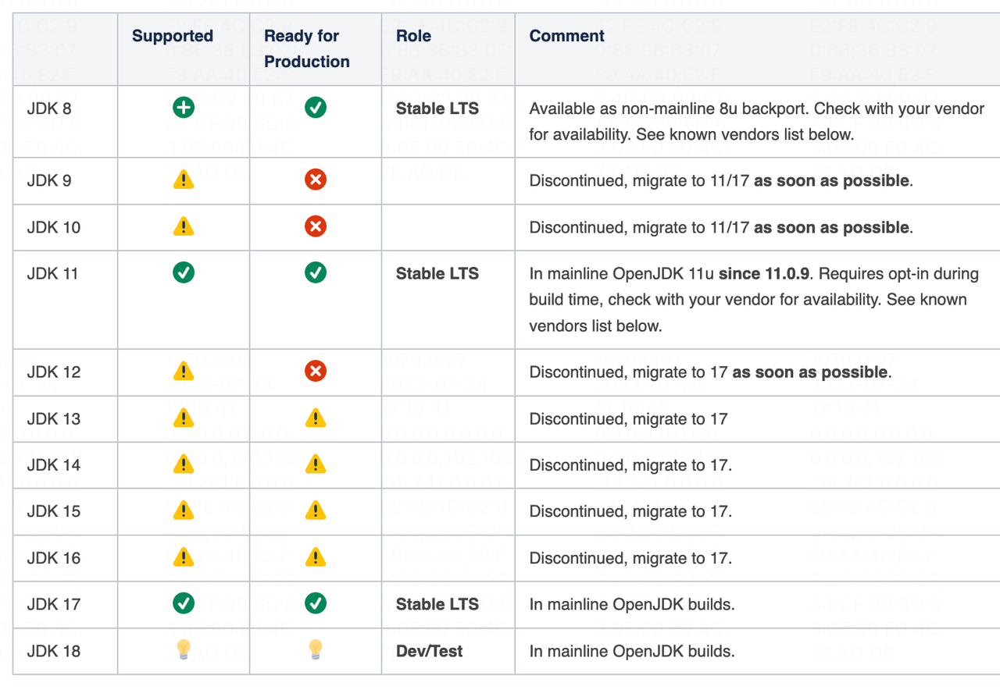
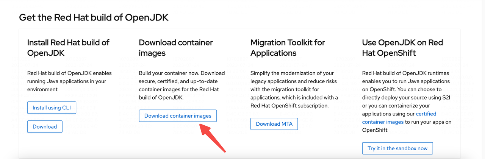
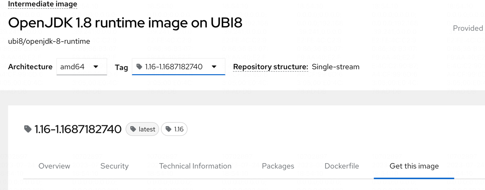
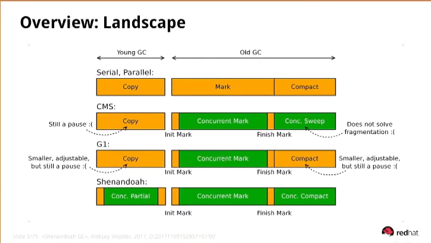
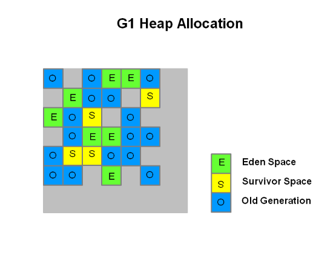
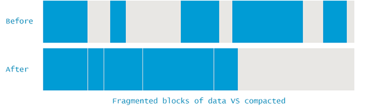
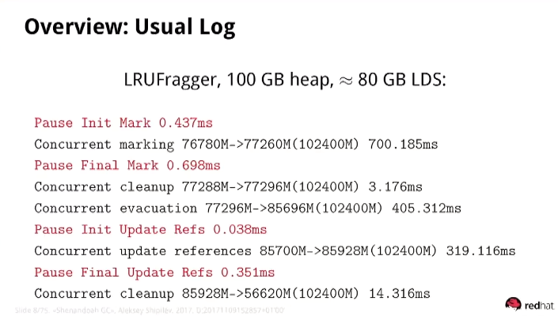
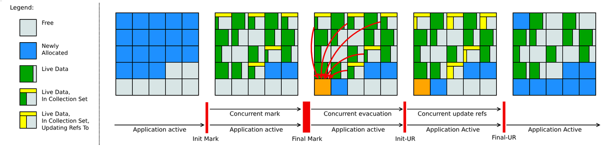
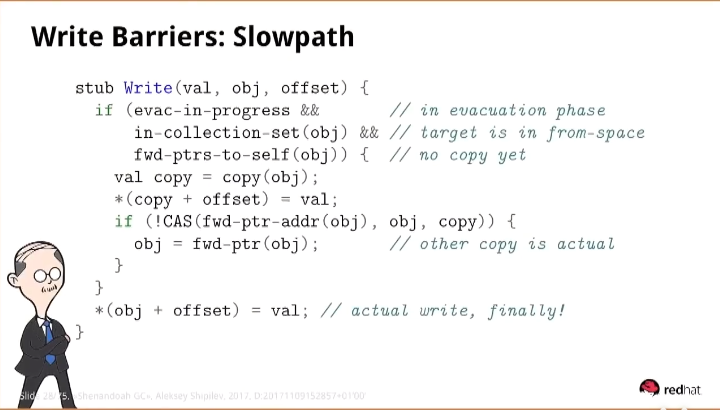
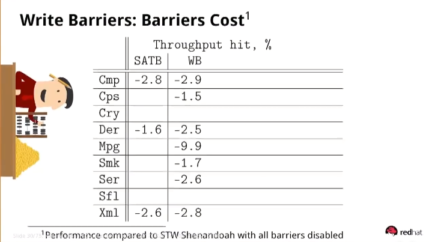

# 前言
**软件工程没有银弹。**携带GC特性的语言虽然在编写上较直接操作内存的编程语言（C、C++、Rust…)来得简单，但是在程序运行时需要付出额外的代价。其中一个反映在Java编写的应用程序上的代价便是GC工作时的STW（Stop The World）。好在自1994年Java1.0a发布以来至今的29年内，Java社区的贡献者一直在不断努力改进。包括但不限于Hotspot的JIT（Just-in-time compilation）和新GC。
# Shenandoah简介
Shenandoah是由Red Hat公司于2014年在JEP189中的提议。Oracle公司拒绝了该提议，后Red Hat公司便将其作为公司的 IcedTea Java Project 的一部分着手推进开发。在JDK12中Shenandoah GC是一个实验性功能，在JDK15中孵化成熟。

Oracle发版的JDK中并不会支持Shenandoah GC。

虽然Shenandoah是在JDK12才作为实验特性推出，但是Red Hat公司随后对JDK的其他版本做了向前兼容。

详见下表：


通过[这个链接](https://developers.redhat.com/products/openjdk/download#assembly-field-downloads-page-content-82031)安装支持Shenandoah GC的JDK。

如果你希望通过容器部署应用，那么你可以进入👆🏻的链接后在页面顶部找到构建好的基础镜像。



官网上提供的镜像都是免费的。


# 启动参数

```shell
# 使用Shenandoah GC
-XX:+UseShenandoahGC 
# 打印各个GC阶段的耗时
-verbose:gc 
-XX+PrintGCDetails
# 以下是推荐参数
# 提前申请堆内存
-XX:+ALwaysPreTouch
# 禁止偏向锁（高版本的JDK以及废弃这个特性了）
-XX:-UseBiasedLocking
# 禁止手动触发GC
-XX:+DisableExplicitGC
```
# 原理探究



G1（Garbage-First Collector）在垃圾收集器和用户线程的并行阶段数量上虽然要比CMS（Concurrent Mark Sweep Collector）少，但因其“块状（region）”的内存结构让它可以根据用户定义的暂定时间做调整——即回收价值最高的一个或多个区域。



需要注意的是，CMS多阶段的并发工作付出的代价就是“内存碎片化”。以至于它需要在某一次GC时压缩内存碎片。这个时间是不可控的，如果程序的老年代较大且没根据应用情况指定一个较好的压缩阈值的话应用程序将会出现长时间的停顿。



## 内存模型

如上图所示，Shenandoah在内存模型上和G1非常类似。它也是以Region为单位划分堆内存，并且和G1一样它也优先回收最有价值的Region。需要注意的是，Shenandoah在目前来说仍是一个不分代的GC。

直至JDK21，分代的Shenandoah仍未能发布。[这是相关的报道](https://www.infoworld.com/article/2338620/java-21-to-drop-generational-shenandoah-gc-feature.html)

下图是Shenandoah在每个阶段堆内存大小的变化。

可以看到在 **Concurrent evacuation** 时堆内存使用量会上升。最终在**Concurrent cleanup**时才会下降。


## 工作阶段



上图概括了Shenandoah在一次GC时所要经历的阶段。

**灰色**区域块代表的是未被分配的内存区域。

**蓝色**块代表的是已被使用的区域。

**绿色**块代表的是经过并发标记之后被视为存活的对象。

**第二个**图中的**黄色**块表示被标记为垃圾的对象。此时该对象所在的区域会被放入Collection Set中。

下面介绍Shenandoah在工作流程中的几个重要阶段：
1. **Init Mark（STW）**：这个阶段和大多数GC一样，标记出Root Set。
2. **Concurrent Marking**：和CMS及G1一样。这个阶段是和用户线程并行的。
3. **Final Mark（STW）**：在并发标记中其和G1一样采用了SATB算法，所以这个阶段是用于纠正并发标记中的错误标记。会产生一定的浮动垃圾。
4. **Concurrent Cleanup**：如果一个区域内的所有对象数据都是垃圾，那么它们会在这个阶段被清除。
5. **Concurrent Evacuation**：**并发复制**存活对象数据到一块新的区域。这便是Shenandoah为什么能是一个低延时的垃圾回收器的主要原因。这个阶段会造成原有的堆内存占用变大。
6. **Concurrent Update References**：并发修改原来的指针，将它们改为指向复制后的对象数据所在的位置。这个阶段是遍历整个堆，按照Collection Set等信息修改当前对象对被复制的其他对象的旧引用。这个时间取决于堆中对象的数量。
7. **Concurrent Cleanup**： 经历过上述阶段之后，旧的数据对象已经没有被应用。所以它们可以被并发回收。上上个图中的堆内存占用只有在这个阶段之后才变小。

## Root Set 示例
```java
public class Example implements Runnable {
    private static int[] array = new int[2];
    public void run() {
        int temp = 0;
        for (int i = 0; i < array.length; i++) {
            temp += array[i];
        }
    }
    public static void main(String[] args) {
        Thread t1 = new Thread(new Example());
        Thread t2 = new Thread(new Example());
        t1.start();
        t2.start();
    }
}
```
在Java中，每个线程都有自己的虚拟机栈，上面保存着局部变量、方法参数、返回值和操作数栈等信息。

上述代码中，array和每个线程的temp变量都被视为Root Set的一部分。

## 转发指针（Forwarding Pointer）
为了做到并发复制（Concurrent Copy），Shenandoah在每个对象头之上多加了一个转发指针（Forwarding Pointer）。
```shell
| -------------------|
| forwarding Pointer |
| -------------------|

| -------------------|
|        mark        |
| -------------------|

| -------------------|
|        class       |
| -------------------|
```
在64位的物理机上，转发指针需要占据8个字节的物理内存大小。
当该一个对象B在一轮GC中被标识为存活时则需要被移动（Evacuation）到新的物理内存地址中。移动后的对象为B'，且标识B所在的内存地址是**From**区，B'所在的内存区域叫**To**区。
在下面的章节中，图中的Class B和Class B'将会用于讨论。

## 如何实现并发移动
### 写屏障
假设现在GC进行到了**Concurrent Evacuation**，用户线程又需要修改B中的内容。此时需要如何处理才能避免用户线程将数据写入了From区中的B？

答案是通过**写屏障**（**Write Barrier**）实现。下图是作者给出的一段关于写屏障的简化伪代码。

需要注意的是，并不是所有关于写的事件都需要通过写屏障。不然的话写屏障的引入将会得不偿失。

当写事件发生且此时正处于GC的工作阶段。那么写事件则会被写屏障拦截。

简单介绍一下上述代码的逻辑：

1. 首先需要做相应的判断。只有在当前GC执行到Concurrent Evacuation阶段、当前写入的对象所在的Region是处于Collection Set中且转发指针仍然指向其本身时我们便知道这个对象是***将要***被移动到其他区域的。

2. 如果条件1成立的话，此时用户线程便会自行复制并将数据写到新的副本之后通过**CAS**修改旧对象上的转发指针。（GC线程才是完成这部分工作的主力军）。

3. 如果CAS失败，那么证明GC已经完成了该对象的移动并且修改了转发指针。不论成功与否，此时的From区的旧对象的转发指针均会指向To区的新对象。这个时候只需要根据转发指针往对应的偏移量写入相应的数据即可。

## 需要付出的代价

转发指针作为支撑并发移动的“魔法”，它本身要占据8个字节的内存空间。这和G1中为了维护跨区引用的**Remember Set**一样都需要付出额外的内存空间。

Shenandoah中维护跨区引用的是一张矩阵表。类原理似图数据结构的邻接矩阵。

除了多余的内存开销，**写屏障**也会损失一定的性能。这也是为什么低延时的GC的吞吐率在基准测试下都不如传统的STW的GC。

下图是shenandoah在各个基准测试下吞吐率的表现。


# 其他低延迟GC

除了Shenandoah，还有两个也是低延迟GC。它们分别是**ZGC**和Azul公司开发的**C4**。

C4不是CSGO中指的炸弹。它的全称是 The Continuously Concurrent Compacting Collector。

不同于Oracle公司的Hotspot虚拟机，C4是搭载在Azul公司开发的Zing虚拟机上。

和ZGC不同的是它是收费的🫣。

ZGC的原理参考了Azul发表的关于C4的论文。

知乎上最权威的Java布道者R大（昵称：RednaxelaFX）曾就职于Azul。并且Azul公司也是最早发布支持Mac arm架构的JDK发行版的社区贡献者。

ZGC和Shenandoah一样，它们都可以在GC过程中进行并发移动。不同于Shenandoah的转发指针，ZGC采取的策略是染色指针。这不在本文讨论的范围之内。由于ZGC至少要在JDK11上才能采用（17上较为成熟），对于目前的大环境来说仍然是一个难以用上的GC。


