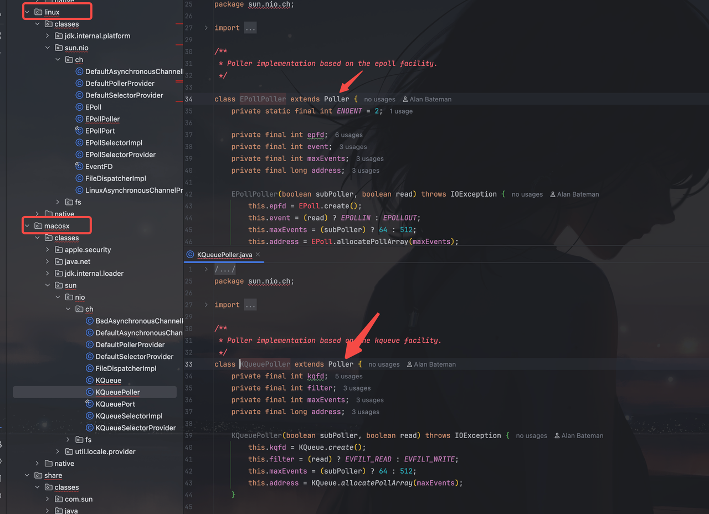
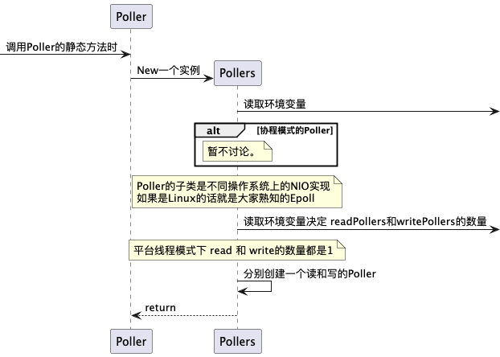
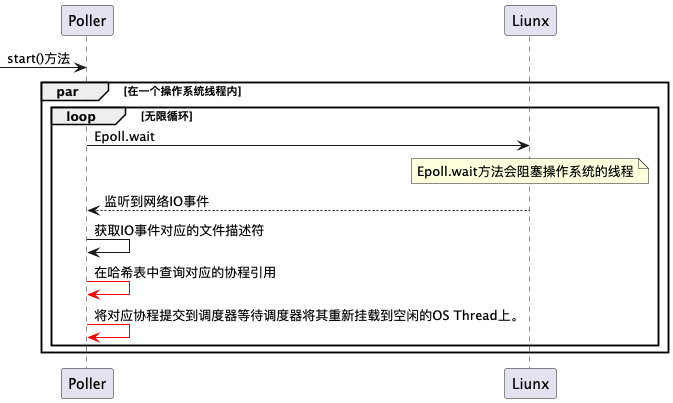

# 引言
Project Loom在JDK24中真正将Virtual Thread（虚拟线程，以下简称协程）的限制解开。以下是相关的JEP。
https://openjdk.org/jeps/491
JDK24之后，协程被赋予了更健壮的躯体：
1. 协程不会因为`synchronize`关键字而被钉死在宿主线程上。
2. JDK重构了`synchronize`底层的monitor的相关机制从而让JVM可以感知协程上携带的锁。
3. 协程发起网络IO时也同样不会被钉死在宿主线程上。
>  JDK并没有对文件IO做改进，所以协程并不适合在文件IO中使用。 
> 
> 实际上我也不认为协程能在文件IO中起多大作用。
> 
> 本文内容聚焦在介绍JDK在网络IO上对协程做的兼容措施。

# 协程的工作机制
> 详细可以参考这个[视频](https://www.youtube.com/watch?v=HQsYsUac51g)
> 
> 可以从15:33看起

TMI：

JDK的协程和Go一样是有栈协程。

借助`Continuation` Java程序可以保存当前协程中的程序计数器、函数调用栈、函数内变量等信息，并将它挪到Heap中等待被重新调度。

由于JVM无法拷贝本地调用的函数调用栈，所以当你在协程内显式调用本地方法时协程就无法被卸载——导致的后果就是协程被钉死在对应的执行线程上进而导致执行线程也一并陷入阻塞

# JDK是如何解决协程调用本地方法时出现的“钉死”

> TMI： 
> 
>JDK通过Poller隔离了系统调用，再封装了一层回调机制。
> 
>协程内调用网络IO实质只是告诉Poller自己要监听的Socket文件，然后就它开始睡大觉。
> 
>Poller中会有两个工人（线程）不舍昼夜的等待操作系统的通知。只有接收到通知他们才会叫醒对应的协程。
> 
>这看起来就像是在事件驱动机制上再实现了一套事件驱动机制。
> 
>Remind: All problems in computer science can be solved by another level of indirection.


>接下来我会带你浏览JDK的NIO相关的源码。

## ServerSocketChannelImpl（Netty、Vertx使用的NIO）
使用协程之后我们可以抛弃原先的响应式编程。
```java

 ExecutorService exe = Executors.newVirtualThreadPerTaskExecutor();
        try(ServerSocketChannel serverSocketChannel = ServerSocketChannel.open()){
            serverSocketChannel.bind(new InetSocketAddress(8080));
           // 使用协程来接受请求时不应该把ServerSocketChannel设置为非阻塞式
            // serverSocketChannel.configureBlocking(false);
            // 不再需要一个Selector来做轮询
            // serverSocketChannel.register(selector, SelectionKey.OP_ACCEPT);
            while (true) {
                // 阻塞直到有事件就绪 （这里也不需要了）
                // if (selector.select() == 0) {
                   // continue;
                // }
                // 等同于 go func(){}
                exe.execute(() -> {
                    try {
                                                        请留意这里的 accept
                        SocketChannel clientChannel = serverSocketChannel.accept(); 
                    } catch (IOException e) {
                        throw new RuntimeException(e);
                    }
                });
                省略处理网络请求的代码
            }
        }catch (IOException e){
            e.printStackTrace();
        }
```
### Accpet
我们来看看JDK在该方法中对协程做的适配

```java
@Override
public SocketChannel accept() throws IOException {
    int n = 0;
    FileDescriptor newfd = new FileDescriptor();
    SocketAddress[] saa = new SocketAddress[1];

    acceptLock.lock();
    try {
        ensureOpen();
        boolean blocking = isBlocking();
        try {
            begin(blocking);
            // 检测到当前是协程调用方法时会将Socket设置为非阻塞
            留意这个方法
            configureSocketNonBlockingIfVirtualThread();
            // 由于是非阻塞，所以这个方法并不会Block
            n = implAccept(this.fd, newfd, saa);
            // 上文提到ServerSocketChannel为阻塞模式，所以这里为 true
            if (blocking) {
                while (IOStatus.okayToRetry(n) && isOpen()) {
                    留意这个方法
                    park(Net.POLLIN);
                    n = implAccept(this.fd, newfd, saa);
                }
            }
        } finally {
            end(blocking, n > 0);
            assert IOStatus.check(n);
        }
    } 
    ...Ignore
}
```
### configureSocketNonBlockingIfVirtualThread

```java
    /**
     * Ensures that the socket is configured non-blocking when on a virtual thread.
     */
    private void configureSocketNonBlockingIfVirtualThread() throws IOException {
        assert acceptLock.isHeldByCurrentThread();
        if (!forcedNonBlocking && Thread.currentThread().isVirtual()) {
            synchronized (stateLock) {
                ensureOpen();
               // 该方法为本地方法。设置后对该Socket文件的读取将不会直接阻塞线程。
                IOUtil.configureBlocking(fd, false);
                forcedNonBlocking = true;
            }
        }
    }
```
### park
```java
default void park(int event, long nanos) throws IOException {
    if (Thread.currentThread().isVirtual()) {
        Poller 是整个机制的核心！！！
        Poller.poll(getFDVal(), event, nanos, this::isOpen);
    } 
    忽略线程情况
}
```

## Poller（NIO中的核心，网络IO监视者）
### poll —— static方法
让我们先点进poll方法浏览一下。
```java
static void poll(int fdVal, int event, long nanos, BooleanSupplier supplier)
    throws IOException
{
    assert nanos >= 0L;
    if (event == Net.POLLIN) {
    // 读取 
        留意这个 poll 方法
        POLLERS.readPoller(fdVal).poll(fdVal, nanos, supplier);
    } else if (event == Net.POLLOUT) {
    // 写入
        POLLERS.writePoller(fdVal).poll(fdVal, nanos, supplier);
    } else {
        assert false;
    }
}
private static class Pollers {
    private final PollerProvider provider;
    private final Poller.Mode pollerMode;
    private final Poller masterPoller;
    留意一下两个成员变量
    private final Poller[] readPollers;
    private final Poller[] writePollers;
}
```
可以发现又出现了另一个叫`Pollers`的私有内部类。且这个`Pollers`内部有着一组`Poller`。
> 一些阅读源码的小tips：
> 
> POLLERS.readPoller(fdVal).poll(fdVal, nanos, supplier);
> 
> 其实等同于 ：
> 
> ${不知道哪里实例化出来的Poller}调用了自身的poll方法。
> 
> 所以我们先看poll方法。

<h3 id="1">poll——普通私有方法</h3>
```java
private void poll(int fdVal, long nanos, BooleanSupplier supplier) throws IOException {
 // Attention Here！
    register(fdVal);
    try {
        boolean isOpen = supplier.getAsBoolean();
        if (isOpen) {
        Socket 没关闭的情况下直接挂起当前协程
            if (nanos > 0) {
                LockSupport.parkNanos(nanos);
            } else {
                LockSupport.park();
            }
        }
    } finally {
        deregister(fdVal);
    }
}
private void register(int fdVal) throws IOException {
  在当前Poller实例的哈希表中存放当前协程的引用，并与该协程要交互的网络IO文件做映射。
    Thread previous = map.put(fdVal, Thread.currentThread());
    assert previous == null;
    try {
    注册到 NIO 机制上的函数。如果你和我一样是MacOS的话你看到的将会是KQueuePoller
        implRegister(fdVal);
    } catch (Throwable t) {
        map.remove(fdVal);
        throw t;
    }
}
```
总结下来这个方法做了以下三件事：
1. 对调用网络IO的协程/线程做了记录
2. 注册Socket IO的文件描述符到操作系统对应的NIO实现。Linux的NIO实现即为大名鼎鼎的Epoll。
3. 直接挂起当前协程。

**这里挂起了当前协程，等到网络IO就绪的时候定然是在某个地方会再唤醒这个协程，否则就说不通了。**


带着这个疑问我们继续浏览`Poller`的全貌以及刚刚略过的`Pollers`

> LockSupport.park()中你会看到JDK针对协程的设计的Continuation。

### Poller的全貌
Poller是一个抽象类，其定义了NIO操作的方法以及围绕NIO操作的辅助方法。

它的子类是不同操作系统的NIO实现，子类只负责实现具体的poll方法。



### Poller的静态加载逻辑
它有一个静态加载逻辑。我们先来看看这块静态加载逻辑做了什么。

```java
public abstract class Poller {
    饿汉式单例
    private static final Pollers POLLERS;
    static {
        try {
            New 一个 pollers实例
            var pollers = new Pollers();
            启动Pollers
            pollers.start();
            POLLERS = pollers;
        } catch (IOException ioe) {
            throw new ExceptionInInitializerError(ioe);
        }
    }
}
private static class Pollers {
    private final PollerProvider provider;
    private final Poller.Mode pollerMode;
    private final Poller masterPoller;
    private final Poller[] readPollers;
    private final Poller[] writePollers;

    // used by start method to executor is kept alive
    private Executor executor;
}
```

### 下图是Pollers的初始化过程。
JDK24.0.1+9中，启动参数jdk.pollerMode的值为1。这意味着Poller是平台线程模式。


### Pollers.start()
下图为start方法的大致逻辑。

红线部分其实就解答了[上文提到的疑惑](#1)

